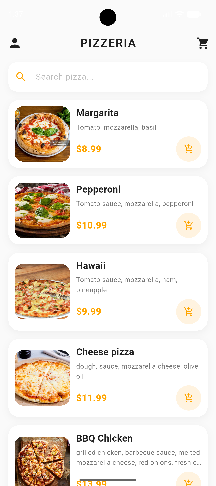
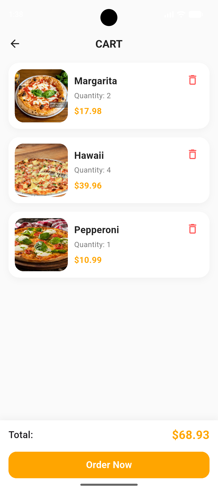
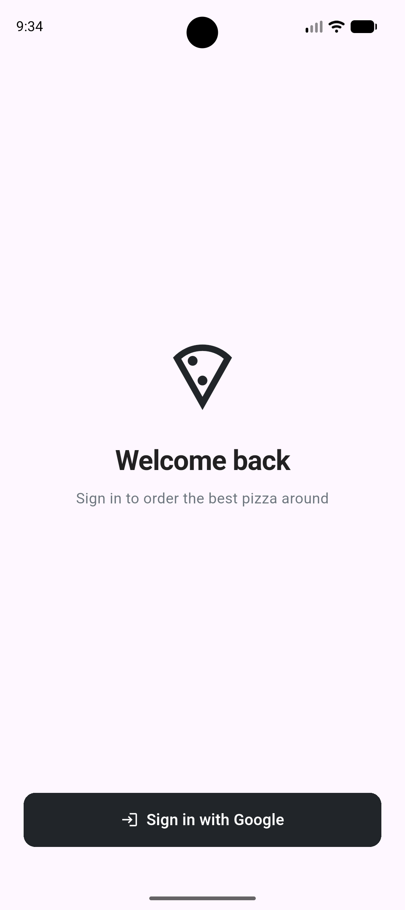
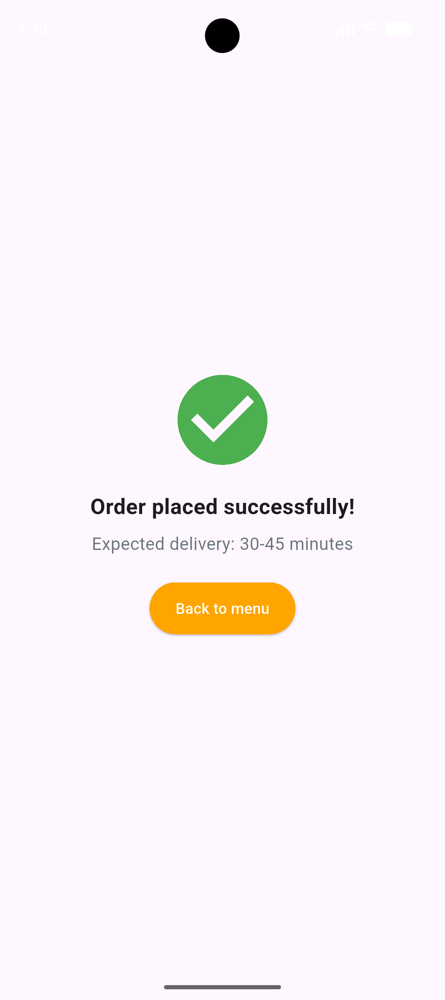
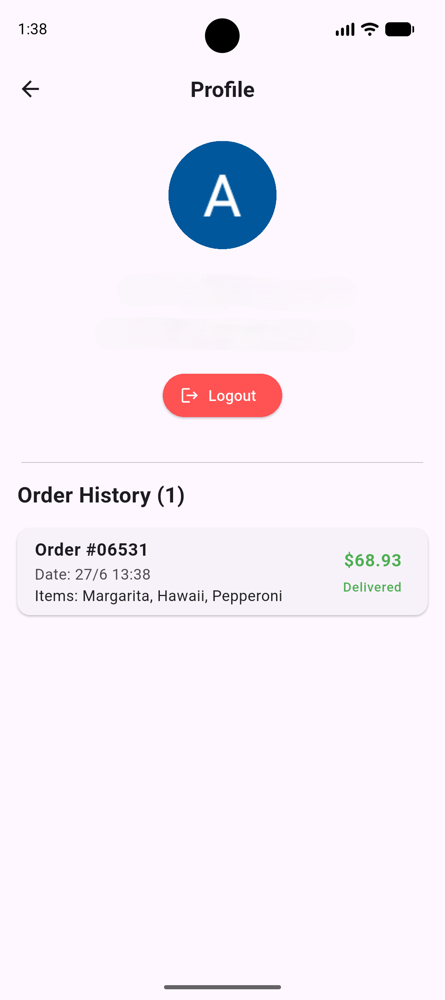

# pizzeria

A Flutter app for ordering pizza with firebase authentication.

## Features

- Browse pizza menu
- Add to cart
- Firebase Auth (login/logout)
- Order history
- Profile screen

## Tech Stack

- Flutter & Dart
- Riverpod (state management)
- Firebase Auth
- GoRouter (navigation)

## Screenshots

   
   
   
   
   
<\p>

## About
I built this app to practice Riverpod and Firebase Auth.
The biggest challenge was to implement Firebase Auth.